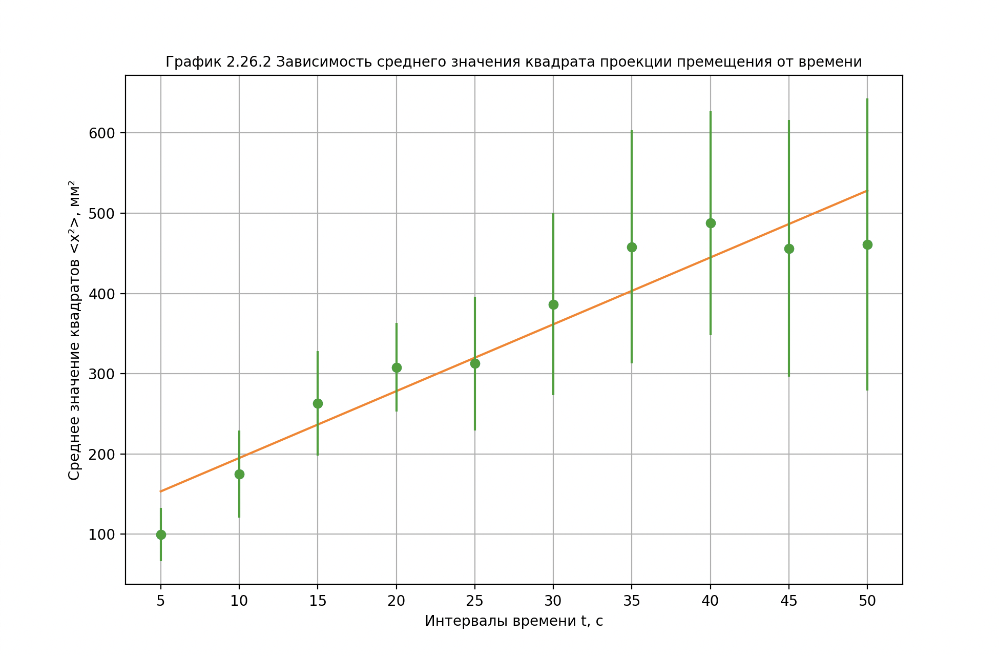
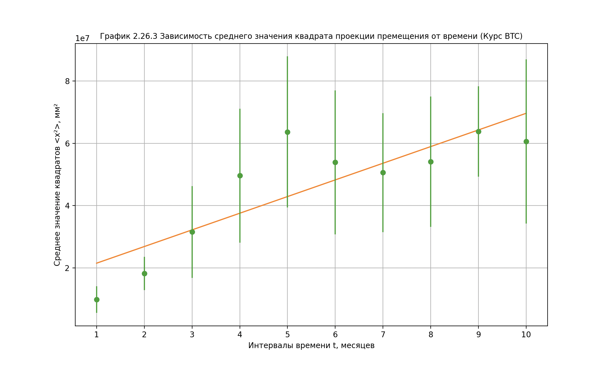

# Лабораторный практикум по физике №2.26
## «Изучение броуновского движения взвешенных частиц»

The purpose of the work was to study the Brownian motion of suspended particles and experimental verification of the law of Brownian motion by Einstein, Smoloukhovskii and Perrin.

>Цель работы состояла в изучении броуновского движения взвешенных частиц и экспериментальной проверке закона броуновского движения Эйнштейна, Смолоуховского и Перрена.

In the first part of the work, a picture of the Brownian motion of suspended particles was observed using a microscope. Further, with the help of computer simulation, the particle motion trajectory was obtained. Then, by projecting the trajectory points onto the introduced axis OX (perpendicular to the drift direction), the displacements were calculated for equal time intervals t, 2t, 3t, etc. Further according to the formula

>В первой части работы наблюдалась картина броуновского движения частиц взвеси с помощью микроскопа. Далее с помощью компьютерного моделирования была получена траектория движения частицы. Затем, спроецировав точки траектории на введенную ось OX (перпендикулярную направлению сноса), были рассчитаны перемещения за равные промежутки времени t, 2t, 3t и т.д.
Далее по формуле

### \$x^2 = \frac{\sum x_{i}^{2}}{n}$ 

the average values of the squares of the projections of displacements for each period of time were calculated:

>были рассчитаны средние значения квадратов проекций перемещений для каждого промежутка времени:

#### \$x^2 = (100 \pm 33)\ мм^2\,\ \\partial\varepsilon_{t} = 33 \\% $
#### \$x^2 = (175 \pm 55)\ мм^2\,\ \\partial\varepsilon_{t} = 31 \\% $
#### \$x^2 = (263 \pm 65)\ мм^2\,\ \\partial\varepsilon_{t} = 24 \\% $
и т.д.

Based on the data obtained, a graph was built (see graph 2.26.2) of the dependence of the average value of the square of the projection of the particle displacement on the value of the time interval during which this displacement occurs. The constructed linear nature of this dependence confirms the theory and proves the validity of Einstein's law of Brownian motion of particles.

>По полученным данным был построен график (см. график 2.26.2) зависимости среднего значения квадрата проекции перемещения частицы от величины промежутка времени, за которое происходит это перемещение. Построенный линейный характер этой зависимости подтверждает теорию и доказывает справедливость закона броуновского движения частиц Эйнштейна.

## Analysis of the price of bitcoin (BTC) over the past year according to Brownian motion

Similarly to the previous task, data was calculated only with the bitcoin price.
>Как и в предыдущей задаче, данные рассчитывались только с ценой биткойна.

According to the received bitcoin chart for 2022 (2.26.3), it can be seen that the dependence is linear within the error, which indicates the validity of Einstein's law of Brownian motion. 

>По полученному графику (2.26.3) биткоина за 2022 год видно, что зависимость имеет линейный характер в пределах погрешности, что свидетельствует о справедливости закона Эйнштейна о броуновском движении.

This tells us that the movement of the Bitcoin exchange rate can be regarded as a Brownian movement.

>Это говорит нам о том, что движение курса биткойна можно рассматривать как броуновское движение.

